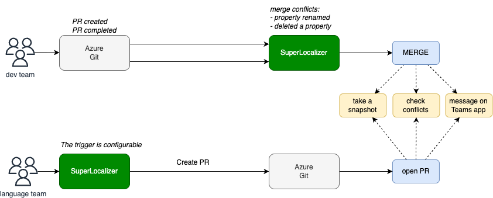

<!-- _class: lead -->
# SuperLocalizer
## Modern Localization Management Platform

**Streamline your translation workflow with collaborative tools**

---

## What is SuperLocalizer?

A **full-stack localization management web application** designed to simplify and enhance the translation workflow for development teams.

### 🎯 **Mission**
Transform how teams manage multilingual content by providing intuitive tools for translation collaboration, verification, and synchronization.

---

## 🌟 Key Features

- **🌍 Multi-language Support** - Manage translations across multiple locales
- **🔍 Advanced Search & Filtering** - Find translations quickly and efficiently
- **💬 Collaborative Comments** - Team communication on translation items
- **📊 Translation Verification** - Quality assurance workflow
- **📈 History Tracking** - Complete audit trail of changes
- **🔄 Automation as pillar** - Create automatic workflows based on your needs

---

## 🏗️ Architecture Overview

### **Modern Tech Stack**

| Component | Technology | Purpose |
|-----------|------------|---------|
| **Backend** | .NET 9.0 ASP.NET Core | RESTful API & Business Logic |
| **Frontend** | Next.js 14 + TypeScript | Modern React-based UI |
| **Cache** | Redis + FusionCache | High-performance caching |
| **Database** | MySQL | Persistent data storage |
| **Authentication** | JWT + OAuth | Secure user management |

---

## 📁 Project Structure

```
SuperLocalizer/
├── backend/                   # .NET Core Web API
│   ├── src/SuperLocalizer/    # Main application
│   │   ├── Controllers/       # API endpoints
│   │   ├── Services/          # Business logic
│   │   └── Repository/        # Data access
│   └── test/                  # Unit tests
├── frontend/                  # Next.js application
│   ├── app/                   # App router structure
│   └── components/            # Reusable UI components
└── docs/                      # Documentation
```

---

## 💬 Collaboration Workflow

### **Translation Review Process**



---
### **Intelligent Merge**
- Auto sync periodically applied or on specific events
- **Developers** - Key renames are applied correctly
- **Translators** - If a conflict happen Superlocalizer try to solve it or notify

### **Multi-stakeholder Feedback**
- **Developers** - Add new translation keys
- **Translators** - Provide accurate translations
- **Reviewers** - Verify quality and context
- **Project Managers** - Track progress

---

## 📊 Quality Assurance

### **Verification System**
- ✅ **Verified** - Approved by reviewers
- ⏳ **Pending** - Awaiting review
- ❌ **Needs Review** - Requires attention
- 🔄 **In Progress** - Currently being translated

### **Quality Metrics**
- Translation completion percentage
- Verification status tracking
- Comment resolution rates
- Change frequency analysis

---

## 🎯 Benefits

### **For Development Teams**
- ⚡ **0% faster** translation effort
- 🔍 **Zero missed** translation keys
- 🤝 **Seamless** designer-developer handoff

### **For Translation Teams**
- 📝 **Contextual** translation environment
- 💬 **Direct communication** no middle layers
- 📊 **Clear progress** visibility

---

## 💰 ROI

- Dev team not involved
- Traslation team autonomous
- Transalation engenieer not needed
- New independent product ready for market

---

## 🗺️ Roadmap & Future Features

### **Q1 2026**
- Install the service
- Set up internally on Supertext workflow
- Start the automation workflow

### **Q2 2026**
- Improve the product features
- Add it on our product offer as preview and schedule a release date
- Design the integration between companies - translation requests

---

## 🎯 Use Cases & Pricing Tiers

### **1. Small Project / Company Superlocalizer**
**Perfect for:** Startups, indie developers, small teams
**Recommended Tier:** **FREE** → **ESSENTIAL ($9/mo)**

**Scenario:** Mobile app launching in 2 languages with 3 developers
**FREE Tier Works For:**
- 1 project included
- Community support
- Integration via API
- Pay per use

---

**Upgrade to ESSENTIAL When:**
- Add 2 more projects (up to 5 total)
- Need GitHub automation
- Require email support
- Use auto-translate features
- Consider to allow paying verification only in Essential

**Cost Benefit:** From $0 → $9/mo as you scale

---

## 🎯 Use Cases & Pricing Tiers

### **2. Medium Company Automation**
**Perfect for:** Growing SaaS, e-commerce, digital agencies
**Recommended Tier:** **ESSENTIAL ($9/mo) → HERO ($29/mo)**

**Scenario:** E-commerce
**ESSENTIAL Tier Covers:**
- Many projects (manage brands separately)
- GitHub automation for dev workflow
- Email support
- Auto-translate to reduce costs and verification to improve quality

---

**Upgrade to HERO When:**
- Need unlimited projects
- Require human verification (ch, de, en, fr, it)
- Want all automation types (not just GitHub)
- Need priority support for high quality translation

**ROI:** $29/mo replaces 10+ hours of manual work monthly

---

## 🎯 Use Cases & Pricing Tiers

### **3. Big Enterprise (no tech) - Design to Deployment**
**Perfect for:** Enterprise software, global brands, large teams with no localization
**Required Tier:** **HERO ($29/mo)**

**Scenario:** Global SaaS with 12 languages, 50+ translators, compliance needs
**HERO Tier Delivers:**
- **Real human experts verification** included for 5 key languages
- **All automation** types (Figma, Jira, CI/CD pipelines)
- **Priority support** with SLA guarantees, and also it integration help

---
<!-- _class: lead -->
## Thank You!

### From small startups to global enterprises

### Ready to transform your localization workflow?

**🌐 Get Started:** `git clone https://github.com/DallaValle/SuperLocalizer`

**📖 Documentation:** `/docs` directory

### 🚀 Live Demo
